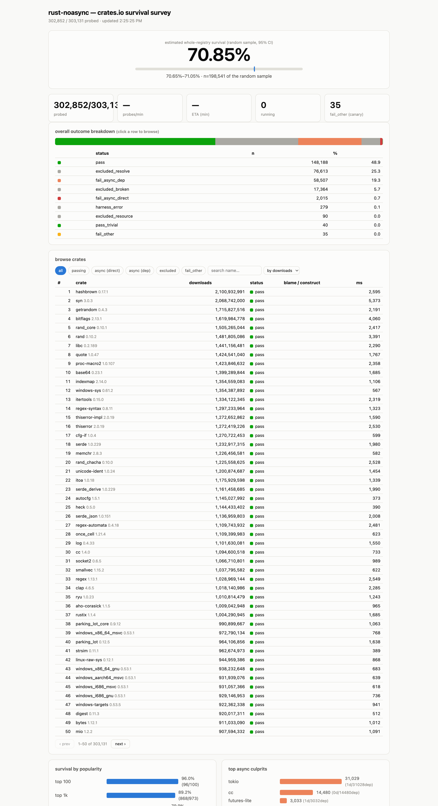

# rust-noasync crates.io survival survey

Measures **how much of crates.io survives [rust-noasync](https://github.com/joelonsql/rust-noasync)** —
the Rust fork where async/await is a hard compile error. Each crate is
build-probed with the fork's toolchain (default features, the version cargo
would pick); it either passes or the *first* failure is recorded and
classified: async syntax in the crate's own code, async syntax in a dependency
(with the culprit named), or unrelated breakage (excluded from the denominator
after confirming it also fails on stock stable Rust).

Results live in a dedicated PostgreSQL cluster; a live web dashboard updates
after every crate.

## Results

_Complete: all 303,131 crates probed. Regenerate the image with
`./make-screenshot.sh`._



**71.0% of build-compatible crates survive rust-noasync** (148,228 of 208,785).
Of *all* 303,131 crates, 48.9% pass outright.

- **What "build-compatible" means.** 94,346 crates (31%) are excluded from the
  denominator because they don't build on **stock stable Rust** either:
  25.3% (76,613) whose latest version won't even resolve — overwhelmingly
  (97.5%) the abandoned deep tail (`kernel32-sys`, `ws2_32-sys`, `encoding`, …
  with yanked/vanished dependencies) — and 5.7% (17,364) that fail to compile on
  stock too (missing system libs, nightly-only, MSRV). The 71% is survival among
  crates that actually build on today's stable Rust.
- **20.0% of all crates fail specifically on async** (60,522): 58,507 through an
  async dependency and only 2,015 on async in their own code. Async breakage is
  overwhelmingly **transitive** — a crate inherits it from deep in its tree.
- **Survival tracks popularity, non-monotonically**: top 100 → **96.0%**, top 1k
  → **89.2%**, top 10k → **79.9%**, top 100k → **65.7%**, all → **71.0%**. The
  mid-tail (the modern async-era ecosystem) is hit hardest; the deep tail
  recovers, being mostly old, simple, pre-async sync libraries.
- **The `fail_other` canary — crates the fork breaks but stock stable compiles —
  is 35 (0.01%)**, so the fork essentially never breaks otherwise-good sync code.
- **Blame concentrates hard**: **`tokio`** (31,029 crates, all but one
  transitively) and — notably — **`cc`** (14,480, *entirely* transitively).
  Recent `cc` versions use an `async` block in their parallel command runner (a
  hand-rolled single-thread executor, not a real async runtime), so any
  dependency graph that enables `cc`'s `parallel` feature — via `zstd-sys`,
  `aws-lc-sys`, `libgit2-sys`, … — fails through it. Then `futures-lite` (3,033),
  `async-task` (1,390), `axum-core` (992), `js-sys` (890), `glib` (648), tail.

## Architecture

- **Host**: a dedicated, disposable PostgreSQL 18 cluster (port 5433) holding
  the crates.io dump + our `noasync` results schema, plus a stdlib Python
  dashboard. The orchestrator runs here and talks to the DB over loopback.
- **Sandbox**: Apple `container` (one lightweight Linux VM per worker). The
  orchestrator drives long-lived containers via `container exec`. Untrusted
  `build.rs`/proc-macro code only ever runs inside a VM, and during `cargo
  check` the network is removed (`unshare -Ur -n`) so foreign code can't phone
  home. DB credentials never enter the sandbox.
- **Toolchains** (baked into `noasync-probe:v1`): the fork built for
  aarch64-linux (`channel=stable`), and stock stable Rust as the control.

```
db.py                 DSN + claim_probe()/record_result() the orchestrator uses
dashboard.py          single-file http.server + SSE + LISTEN/NOTIFY
import_dump.sh        (documented below) fetch+load the nightly dump
sql/01_noasync_schema.sql   results schema + claim/complete/sweep/touch functions
sql/02_populate_probes.sql  build the work queue from the dump
verify_claims.py      concurrency test for the claim/sweep logic
smoke_seed.py         synthetic results to exercise the dashboard
container/            Containerfile, apt list, Linux bootstrap config, build+verify scripts
probe/probe.sh        in-container: fetch | check | control | clean | netoff-verify | gc
orchestrator/         config, runner (container exec), lifecycle, classify, orchestrator, fixtures
```

## One-time setup

```sh
PGBIN=/Applications/Postgres.app/Contents/Versions/18/bin
SURVEY="$HOME/rust-noasync-survey"   # or wherever you cloned this repo

# 1. dedicated cluster (port 5433, own data dir, tuned for bulk load)
"$PGBIN/initdb" -D "$SURVEY/pgdata" --encoding=UTF8 --locale=C -U "$(whoami)"
#   append port=5433, listen_addresses='127.0.0.1', shared_buffers=8GB,
#   maintenance_work_mem=8GB, work_mem=256MB to pgdata/postgresql.conf
#   (fsync=off during import; ALTER SYSTEM SET fsync=on afterwards)
"$PGBIN/pg_ctl" -D "$SURVEY/pgdata" -l "$SURVEY/logs/pg.log" -w start

# 2. dump: download, extract, drop version_downloads, load schema+data
cd "$SURVEY/dump"
curl -fL -o db-dump.tar.gz https://static.crates.io/db-dump.tar.gz
tar -xzf db-dump.tar.gz --strip-components 1 -C current
sed -i '' '/version_downloads/d' current/import.sql   # exclude the 90-day history table
#   comment out CREATE/COMMENT EXTENSION crunchy_pooler,pgaudit in current/schema.sql
"$PGBIN/createdb" -h 127.0.0.1 -p 5433 rust_crates
"$PGBIN/psql" -h 127.0.0.1 -p 5433 -d rust_crates -f current/schema.sql
cd current && "$PGBIN/psql" -h 127.0.0.1 -p 5433 -d rust_crates -f import.sql

# 3. results schema + work queue
"$PGBIN/psql" -h 127.0.0.1 -p 5433 -d rust_crates -f "$SURVEY/sql/01_noasync_schema.sql"
"$PGBIN/psql" -h 127.0.0.1 -p 5433 -d rust_crates -f "$SURVEY/sql/02_populate_probes.sql"

# 4. containers: build the base + probe images (fork toolchain baked in)
container system start --enable-kernel-install
cd "$SURVEY/container"
container build -t noasync-base --target base -f Containerfile ctx
#   build the Linux fork toolchain once (see container/builder-inner.sh), then:
container build -t noasync-probe:v1 --target probe -f Containerfile ctx
```

## Running

```sh
cd "$HOME/rust-noasync-survey"                    # or your clone path
ulimit -n 4096 && python3 dashboard.py &          # http://127.0.0.1:8787

# full run (both queues, 6 workers, until drained):
python3 orchestrator/orchestrator.py

# useful variants:
python3 orchestrator/orchestrator.py --limit 100 --queue popular   # top-N milestone
python3 orchestrator/orchestrator.py --fixtures orchestrator/fixtures_run.py  # validation set
```

The DB is the only state: kill the orchestrator any time (SIGINT finishes
in-flight probes), rerun to resume. `sweep_stale` reclaims a dead worker's
probes after 15 min; the orchestrator heartbeats live claims every 60s.
The full 303,131-crate run took ~4 days on an M3 Max (6 workers, warm caches),
faster than the original ~2-week estimate.

## Notes / caveats

- **cargo is beta-built**: the fork can't compile cargo's own async source, so
  the survey's fork cargo is the stock-beta-built binary (behaviorally
  identical — it just invokes the fork rustc). Resolution outcomes are
  therefore not fork-influenced.
- Probing is **default features only** (v1). The schema's `feature_config`
  column is ready for per-feature probes later.
- **Excluded** = not counted against the fork: fails the fork with a non-async
  error *and* fails stock stable too (missing system lib, nightly-only, MSRV).
  `fail_other` (fork fails where stock passes) is the canary for fork bugs and
  should stay ≈ 0.
- Container DNS: the vmnet gateway resolver is flaky for some hosts, so workers
  use `--dns 8.8.8.8`.
- The cluster is disposable — everything is re-creatable from the nightly dump.
